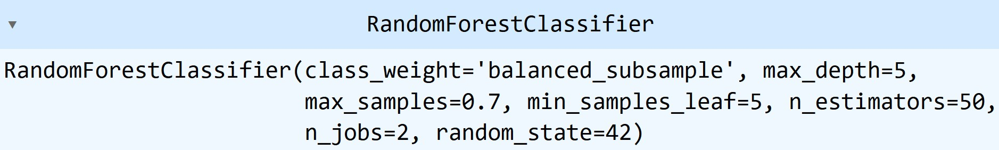
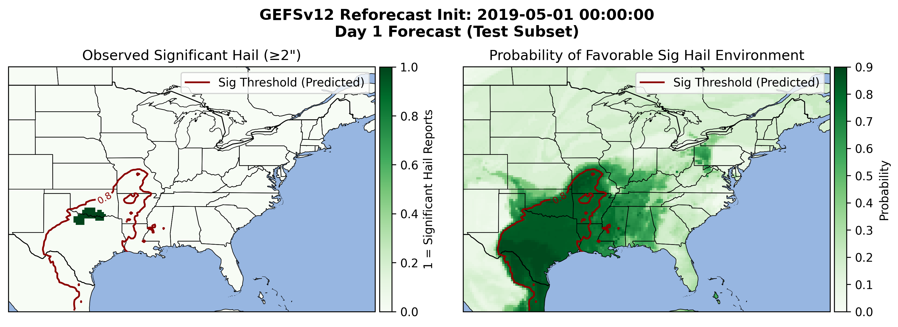
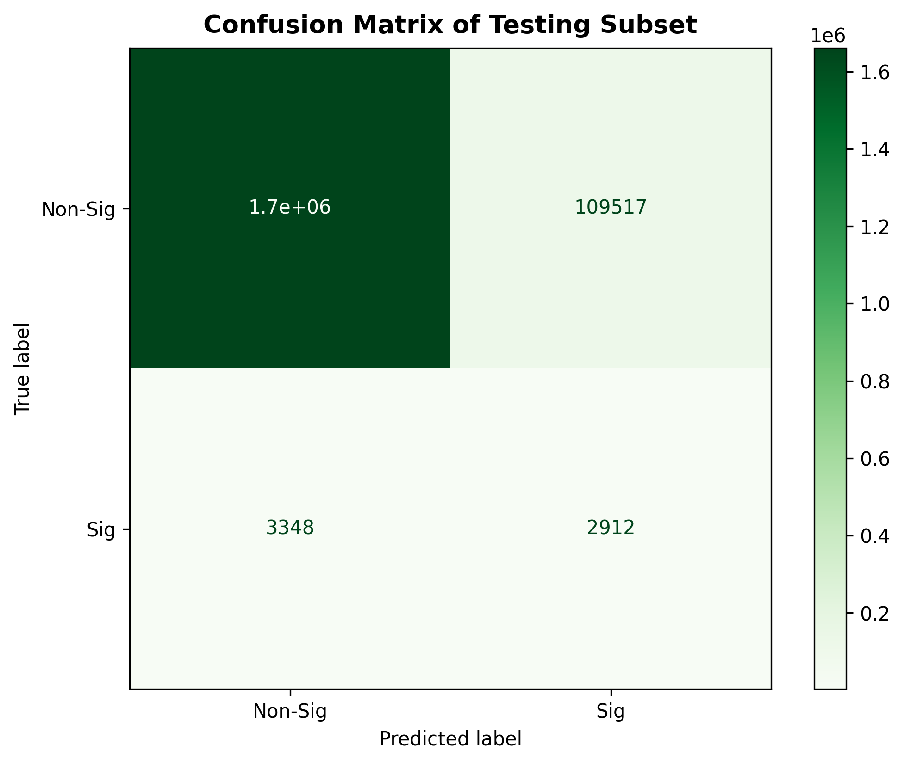
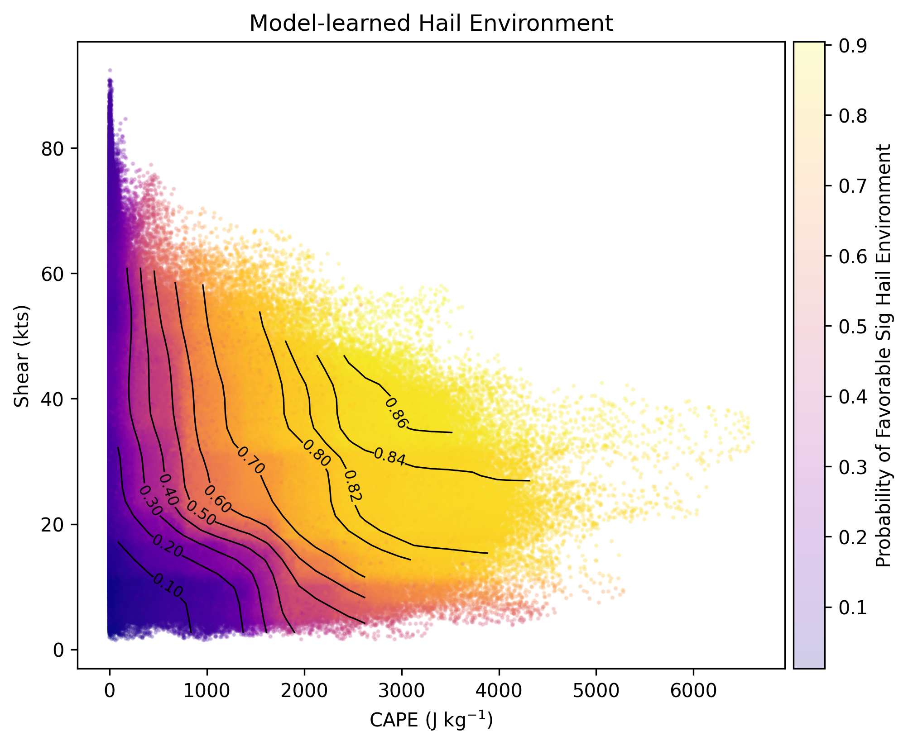
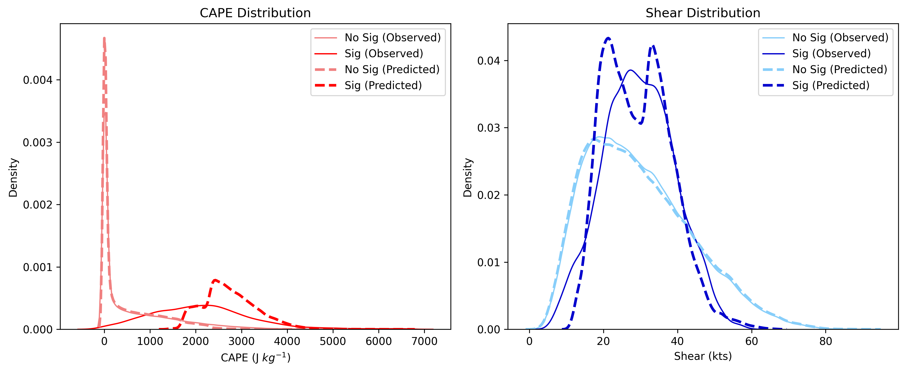

# Predicting Significant Hail Environments with GEFS: A Machine Learning Approach

Samantha Harrison and Landon Moeller

EAE 483

Spring 2026

-------------------------------------------------------------------------------------------------------------------------------------------

## Geoscience Problem

Out of the three perils associated with severe thunderstorms (tornadoes, hail, and damaging winds), hail is by far the costliest. Each year, hail losses often exceed $10 billion in the Contiguous United States (CONUS), accounting for more than half of total severe weather losses. Recent analyses indicate that hail can represent 50–80% of insured losses from severe convective storms in the CONUS, with annual severe convective storm insured losses frequently exceeding $50 billion in recent years (Cape Analytics 2023; Insurance Information Institute 2026). Large hail events have also become more frequent over time in the CONUS, aligning with an increase in insured losses (Battaglioli et al. 2026).

Hail forms in thunderstorms when raindrops or small ice embryos are lofted by strong updrafts into a favorable -10°C to -30°C region of the cloud, called the hail growth zone (HGZ), where they accrete layers of supercooled water. Hailstone growth continues if the updraft can support the hailstone against gravity, provided there is sufficient residence time in the HGZ with adequate liquid water content (Allen et al. 2020). Stones with longer residence time tend to be larger than those with shorter residence time. Hailstones fall out of thunderstorms once they either become too heavy for the updraft or are ejected out of the HGZ/updraft.

Environmental conditions are important in determining whether hail is favored to form and how large it may become. At a basic level, high convective available potential energy (CAPE), supports stronger and wider updrafts capable of suspending hailstones in a growth regime for longer periods. Another important environmental consideration is vertical wind shear, as it plays a key role in organizing thunderstorms. These organized thunderstorms can sometimes rotate and thus be considered supercells instead of transient or messy storms, also supporting longer residence times and a larger hail embryo source region (Dennis and Kumjian 2017).

The prediction of hail size remains a challenge at both the short range/storm scale and medium range/synoptic scale. While short-term hail probability products exist, particularly with the use of machine learning (Hill et al. 2020), there currently does not exist a tool to estimate the potential hail size days in advance on a broad scale. Visualization of hail occurrence probability is already useful but could be further paired with a maximum hail size product to highlight the possible upper-end impact. With the largest hail events causing the most damage, having such a tool could offer early signs for areas that have the potential for large hail (≥1 in./25.4 mm) to very large hail (>2 in./50.8 mm) to occur. 

## Data and Methods

The goal of this project is to produce an eastern CONUS map that shows predicted probabilities of a favorable significant hail environment, highlighting where the potential is largest for significant hail to occur. This product will not necessarily consider potential realization of convective storms but rather will be environmentally based with thermodynamic and kinematic fields. This tool will be designed to only be run in the spring and summer. In an operational setting, areas that stand out can be examined to assess potential for such a scenario to unfold in a region. 

The data that will be used to train the ML model is the Global Ensemble Forecast System Version 12 (GEFSv12) reforecast data paired with the historical hail reports archive from the SPC. GEFSv12 reforecast data is stored on AWS with 4x daily runs and 5 member (one control member and four perturbed members) from 2000-2019 (AWS). The GEFSv12 reforecast runs that we will be choosing will be the 00 UTC cycle only, May 1 00 UTC – June 1 00 UTC, as the eventual live data will also be chosen from the 00 UTC cycle. Reforecast data contains basic atmospheric variables (u wind, v wind, vertical velocity, temperature, height, and specific humidity) at 25 pressure levels from 1000 hPa up to 1 hPa. The reforecast data is stored in two separate files for each run, one for variables below 700 hPa and another for variables above 500 hPa. Horizontal resolution below 700 hPa is 0.25° and above 700 hPa is 0.50°. The GEFS data was converted to much smaller daily .nc files and regionally confined to the eastern CONUS. Hail report data is stored in .csv files on the SPC website (SPC). These exist in individual files for years and decades, but also in one single zip file for all years back to 1950. For simplicity, we downloaded the full file and then filtered to the period we choose to match with our GEFSv12 reforecast data. The GEFSv12 reforecast data were downloaded via a custom script. Pandas was used to open the hail report database. Cartopy and matplotlib are used to build output maps. Scikit-learn was used to train a random forest (RF) classifier model. This type of RF was used because it can work with binned, non-continuous data. In the context of this project, SPC storm reports are not continuous. To provide an environment to the ML model, we downloaded and computed the following parameters:
	
	- Surface-based convective available potential energy (SBCAPE)
	
	- 850-250 hPa bulk wind difference (BWD)

  
We used a configuration of the RF classifier model that was not too computationally expensive but not too limited either. No parameter testing was conducted. The ML model was trained on 2000-2013 data, validated on 2014-2016 data, and tested on 2017-2019 data from the GEFSv12 reforecast and SPC hail reports. This was a simple dataset segmentation rather than use of a train/test splitting function.

| **Python Tool**     | **Purpose**              | **Experience Level** | **Notes**                                                                 |
|-----------------|----------------------|------------------|----------------------------------------------------------------------|
| Herbie          | Loading Model Data   | Fair (3/4)       | One group member has experience with loading in HRRR/RAP data       |
| Scikit-learn    | Machine Learning     | Poor (1/4)       | No experience, just understand the concept                          |
| Cartopy         | Mapping              | Good (3/4)       | Both group members have used this package to produce maps           |
| Matplotlib      | Graphs               | Great (4/4)      | Both group members have used this package to produce plots          |
| Pandas          | Reading Tabular Data | Good (3/4)       | Have used this in the past for lessons/labs and for basic reading   |
| Overall Team    | Combined Skillset    | Moderate (3/4)   | Strong in visualization, developing in machine learning             |

  <em>Table 1. Assessment of group members' experience with various Python packages.</em>

## Feasibility and Ambition

This type of project has been done before, except for general severe and hail probabilities (Mazurek at al. 2025). Nothing has been conducted yet that explores the favorability of an environment for significant hail. Our team generally has the required geoscience knowledge of spatial data, analysis methods, data visualization, and cartography. Our team is mostly comfortable with Python. A lot of data was required for this project. For the training alone, 620 runs of the GEFSv12 reforecast were read in. Each run has 3-hour time increments, which means 40 timesteps total for each variable (F00-F120). As for the hail data, tens of thousands of hail reports were downloaded. For computing, a CPU was needed to process and train the data. The data download, preprocessing, and model building was done on NIU EAE’s TRITON server, as GEFSv12 raw grib2 files totaled 2 TB in size. Our general understanding of all parts of this project is that a lot of data will need to be read in and processed in python, that a random forest model will most likely be used to train with the data, that testing/validation will need to be done with some of the remaining data, and that the output will be in a concise map form for viewer digestion. 

## Potential Issues

The main area where we could envision issues arising is the collection of reforecast data and the performance of parameter computations on that data. It would require a lot of niche coding and code run time. If we go with more of a simple approach (ie. less parameters), the fear is that the model would not perform so well, but at least we know we would be able to produce a product with the time that is left in the semester. If we wanted to do a MUCAPE calculation, it would have to be done at every grid point, at every timestep, and for every initialized run. This is a significant limitation, meaning it will likely not be done. For the computation of wind shear, the only problem that lies in the way is the fact that every other grid point becomes NaN at 700 hPa and above, effectively as a 0.5 deg resolution. To overcome this, we will have to interpolate NaNs and then calculate on the 0.25 deg grid to match the CAPE grid. The challenge that comes with the sparse SPC hail reports is that they are non-continuous and not gridded, meaning they will have to be gridded to match the GEFSv12 for proper incorporation. As of the late semester, the GEFSv12 reforecast data took far longer to download than anticipated.

## Timeline

| **Task** | **Estimate** | **Confidence** | **Notes** |
|----------|-------------|----------------|-----------|
| Gather GEFSv12 reforecast data  | 1 week | Good (3/4) | We know that there is a python package made specifically for this purpose |
| Process GEFSv12 reforecast data and perform calculations | 3 weeks | Fair (2/4) | Our group knows there are grib2 files that will need to have calculations performed on them with Metpy. We will also need to properly select data from the right pressure levels. |
| Train the machine learning model | 4 weeks | Poor (1/4) | No group members have trained a machine learning model before, so it is hard to anticipate how long this will take. |
| Write up the results | 2 weeks | Good (3/4) | Both group members have written up scientific results before and discussed them in a course paper or research article. |

  <em>Table 2. The expected timeline for this project.</em>

## Results

  

  <em>Figure 1. Random Forest Classifier model configuration.</em>

This RF classifier model was configured to be trained with 50 shallow decision trees that has leaves with at least 5 samples (Fig. 1). Each of these trees was trained on 70% of the train subset and the hail classes were re-weighted to reduce the effect of the significant proportion of zeroes in the dataset. This configuration was designed to be less computationally expensive. The model was trained on CAPE and shear and used them to predict the target, which was significant hail. There were two outputs of this model, one being the probability of a favorable significant hail environment, and the other being the predicted significant hail class. These output maps are side by side subplots available for any day in the testing dataset in which significant hail is observed in the SPC database (Fig. 2). Running through these different days showed wide varying solutions, from some properly catching the narrow channel in which significant hail occurred to missing entirely. The cases where significant hail occurred outside of the highest probability area, especially when to the north, are likely a direct consequence of not considering the most-unstable parcel in the lowest 300 hPa. This means that many instances of significant hail from elevated thunderstorms were missed entirely, as SBCAPE is often near zero in these elevated environments (Bunkers et al. 2002). The use of SBCAPE was one of the major limitations of this project, and the effects of it are seen in the output.

  

  <em>Figure 2. An example of the model map output, with observed SPC gridded significant hail reports (left) and predicted probability of a favorable significant hail environment (right). The 80% probability threshold is contoured on both subplots.</em>

The threshold of 80% probability was used to consider grid points to be significant hail, as backed by threshold testing conducted with the validation subset. The model performed poorly at predicting significant hail, as expected. This is because 99% of the dataset was non-significant grid (zeroes from the class perspective). The poor performance is a result of class imbalance in the dataset, leading to misleading results in the confusion matrix and performance summary (Luque et al. 2019). The model did well at predicting zeroes, but that is not what the target of this project was. According to the recall of 46.5%, just under half of significant hail events were predicted by the model (Fig. 3). On the other hand, only 2.6% of predicted significant hail events were correct. This is exactly what was expected, given that no precipitation nor convective precipitation variable was considered. This is common when examining environments separately from storm occurrence (Tippett et al. 2015). The accuracy of 93.6% is misleading in this sense, as the vast majority of that comes from predicting a non-significant label.

  

  <em>Figure 3. The confusion matrix for this model by non-significant and significant hail.</em>

  

  <em>Figure 4. A scatter plot of predicted SBCAPE and 850-250 hPa shear, colored by predicted probability of a favorable significant hail environment. Probability contours are overlaid.</em>

Our model was able to effectively learn the relationship between kinematic + thermodynamic fields and significant hail, as noted by the increase in probabilities for a favorable significant hail environment as CAPE and shear increase (Fig. 4). This indicates that the model has found a positive correlation between these, though certainly not in a perfect linear manner (Lin and Kumjian 2022). For example, higher probabilities extend towards lower values of CAPE most when shear is higher, indicating the detection of high-shear low-CAPE compensation (Sherburn and Parker 2014). Once CAPE increase beyond 1000-1500 J/kg, the model becomes less reliant upon shear and more upon CAPE, as noted by the clockwise turn in the “elbow” of the probability contours. This dependence upon higher CAPE for significant hail environments is also seen when examining the CAPE and shear distributions between observed/predicted and non-significant/significant hail (Fig. 5).

  

  <em>Figure 5. The SBCAPE (left) and 850-250 hPa shear (right) distributions between observed and predicted non-significant hail and significant hail.</em>

## Summary

The motivation for this project was to improve the detection of large hail risk at the short and medium range with a daily maximum hail size map. Because the largest contribution of insured losses from severe storms is associated with damaging hail, it is of interest to highlight areas where this peril may exist. Predicting where significant hail is favored in advance is important. The goal is to make some headway on this with the use of a machine learning model. The methods of this project are fairly simple. We use 620 days of GEFSv12 reforecast data and thousands of SPC hail reports as data for training, validation, and testing of a random forest classifier model. The machine learning model is to understand relationships between environmental conditions (SBCAPE and 850-250 hPa shear) and large reported hailstones. Then, these relationships are used to predict the probability of favorable environments for significant hail across the eastern CONUS by using basic thermodynamic and kinematic fields. This model effectively learned these relationships, though did not effectively capture all significant hail cases. Future efforts of this study would involve including precipitation fields to predict more localized significant hail grids, rather than just environments. A more robust RF classifier model would also be used.

## References

Allen, J. T., I. M. Giammanco, M. R. Kumjian, H. Jurgen Punge, Q. Zhang, P. Groenemeijer, M. Kunz, and K. Ortega, 2020: Understanding Hail in the Earth System. Reviews of Geophysics, **58**, e2019RG000665, https://doi.org/10.1029/2019RG000665.

Battaglioli, F., M. Taszarek, P. Groenemeijer, T. Púčik, and A. Rädler, 2026: Contrasting trends in very large hail events and related economic losses across the globe. Nat. Geosci., **19**, 52–58, https://doi.org/10.1038/s41561-025-01868-0.

Bunkers, M. J., B. A. Klimowski, J. W. Zeitler, R. L. Thompson, and M. L. Weisman, 2002: The importance of parcel choice and the measure of vertical wind shear in evaluating the convective environment. Preprints, 21st Conf. on Severe Local Storms, San Antonio, TX, Amer. Meteor. Soc., JP3.16.

Dennis, E. J., and M. R. Kumjian, 2017: The Impact of Vertical Wind Shear on Hail Growth in Simulated Supercells. Journal of the Atmospheric Sciences, **74**, 641–663, https://doi.org/10.1175/JAS-D-16-0066.1.

Hail Risk: The Growing Threat for Property Insurers,. CAPE Analytics. Accessed 17 April 2026, https://capeanalytics.com/blog/hail-risk-for-property-insurers/.

Hill, A. J., G. R. Herman, and R. S. Schumacher, 2020: Forecasting Severe Weather with Random Forests. Monthly Weather Review, **148**, 2135–2161, https://doi.org/10.1175/MWR-D-19-0344.1.

Lin, Y., and M. R. Kumjian, 2022: Influences of CAPE on Hail Production in Simulated Supercell Storms. Journal of the Atmospheric Sciences, **79**, 179–204, https://doi.org/10.1175/JAS-D-21-0054.1.

Luque, A., A. Carrasco, A. Martín, and A. De Las Heras, 2019: The impact of class imbalance in classification performance metrics based on the binary confusion matrix. Pattern Recognition, **91**, 216–231, https://doi.org/10.1016/j.patcog.2019.02.023.

Mazurek, A. C., A. J. Hill, R. S. Schumacher, and H. J. McDaniel, 2025: Can Ingredients-Based Forecasting Be Learned? Disentangling a Random Forest’s Severe Weather Predictions. Weather and Forecasting, **40**, 237–258, https://doi.org/10.1175/WAF-D-23-0193.1.

Sherburn, K. D., and M. D. Parker, 2014: Climatology and Ingredients of Significant Severe Convection in High-Shear, Low-CAPE Environments. Weather and Forecasting, **29**, 854–877, https://doi.org/10.1175/WAF-D-13-00041.1.

Tippett, M. K., J. T. Allen, V. A. Gensini, and H. E. Brooks, 2015: Climate and Hazardous Convective Weather. Curr Clim Change Rep, **1**, 60–73, https://doi.org/10.1007/s40641-015-0006-6.

Triple-I: Severe Convective Storms Generate More Than $50B in Insured Losses for Third Consecutive Year | III,. Accessed 17 April 2026, https://www.iii.org/press-release/triple-i-severe-convective-storms-generate-more-than-50b-in-insured-losses-for-third-consecutive-year-041326.

-------------------------------------------------------------------------------------------------------------------------------------------

## Project Requirements Document

| *PR-01.A: Download GEFSv12 Reforecast Data (grib2 files)* |
|---|
| Priority: High |
| Sprint: 1 |
| Assigned to: Landon |
| As a developer of a machine learning model, I need to gather an analysis dataset so I have data that I can train my model on. |
| Acceptance Criteria: Downloaded files must be in grib2 format and be subset to 00z initialized runs between May 1, 2000 and May 31, 2019. |
| Status: Completed |

| *PR-01.B: Download SPC Hail Reports (csv files)* |
|---|
| Priority: High |
| Sprint: 1 |
| Assigned to: Samantha |
| As a developer of a machine learning model, I need to gather a secondary analysis dataset so I have data that I can train my model on. |
| Acceptance Criteria: Downloaded files must be in csv format and be subset to 2000-2019. |
| Status: Completed |

| *PR-02: Subset GEFSv12 Data Regionally into netCDF Files* |
|---|
| Priority: High |
| Sprint: 1 |
| Assigned to: Landon |
| As a developer of a machine learning model, I need to reduce the size of data required and make it easier to work with. |
| Acceptance Criteria: • Dataset must be output as a .nc file and stored in the EAE Triton scratch folder. • Dataset must be a significantly smaller size than when in .grib2 form. • Dataset must be centered over the eastern Contiguous United States. |
| Automatic Test: Check the size of output files and plot a spatial map of a variable to make sure it is over the correct area. |
| Status: Completed |

| *PR-03: Calculate Variables from GEFSv12 Reforecast Data with MetPy* |
|---|
| Priority: High |
| Sprint: 2 |
| Assigned to: Both Members |
| As a developer of a machine learning model, I need to calculate new variables from my dataset to serve as proper model input. |
| Acceptance Criteria: • Scripts must be able to calculate variables with 3-dimensional data on pressure surfaces. |
| Automatic Test: Plot a map of the computed variables to make sure they were computed at every grid point and timestep. |
| Status: Revised… no MetPy necessary |

| *PR-04: Create Data Subsets for Training, Validating, and Testing* |
|---|
| Priority: High |
| Sprint: 2 |
| Assigned to: Samantha |
| As a developer of a machine learning model, we need to create separate datasets from the original hail data to train the model and verify and test its function to ensure it produces accurate results. |
| Acceptance Criteria: • Hail dataset must be split into three separate datasets based on years. • Each individual dataset must be appropriately scaled in terms of size, such as the 70/10/20 rule. Model will be trained on earlier data and tested on more recent data. • Datasets should roughly match overall distribution to confirm legitimacy and avoid biases |
| Automatic Test: Create a script that will generate statistics on each of the three datasets. If statistics do not match well enough, we will revise. |
| Status: Completed |

| PR-05: Format GEFSv12 Reforecast Data and SPC Hail Reports for RF-Classification model |
|---|
| Priority: Medium |
| Sprint: 3 |
| Assigned to: Both Members |
| As a developer of a machine learning model, I need to format the data in order to develop and train my model. |
| Acceptance Criteria: • Reforecast Data and SPC hail reports must be reduced to only what is necessary • We will keep only the years and variables that are needed for the model • Data should be formatted into a csv file that can be inputted into the scikit-learn RF framework |
| Automatic Test: Create a script that reads the csv file and checks if all fields/data are present. If not, generate an error showing what is missing. |
| Status: Completed |

| PR-06: Train & Validate RF-Classification model |
|---|
| Priority: High |
| Sprint: 3 |
| Assigned to: Both Members |
| As a developer of a machine learning model, we need to train the model using the hail report data and variables so we can predict maximum hail sizes based on weather conditions. |
| Acceptance Criteria: • RF model should use scikit-learn • Model output should be formatted in such a way that the model will display its predicted hail sizes as atmospheric data is entered. |
| Automatic Test: Create a script that tests model output for desired output (i.e. predicted hail size, affected areas, etc.) |
| Status: Completed |

| PR-07: Test RF-Classification model |
|---|
| Priority: Medium |
| Sprint: 3 |
| Assigned to: Both Members |
| As a developer of a machine learning model, I need to test the model using a fraction of my reforecast data, so I know how well my model does at predicting max hail size at different lead times. |
| Acceptance Criteria: • Model output must be plotted on a map • SPC hail reports should be plotted on the same map |
| Automatic Test: Write a script that plots model output with SPC hail reports overlaid to check for spatial accuracy. |
| Status: Completed |

------------------------------------------------------------------------------------------------------------------------------------------

GEFSv12 Reforecast Data: https://noaa-gefs-retrospective.s3.amazonaws.com/index.html

SPC Hail Reports: https://www.spc.noaa.gov/wcm/#data
